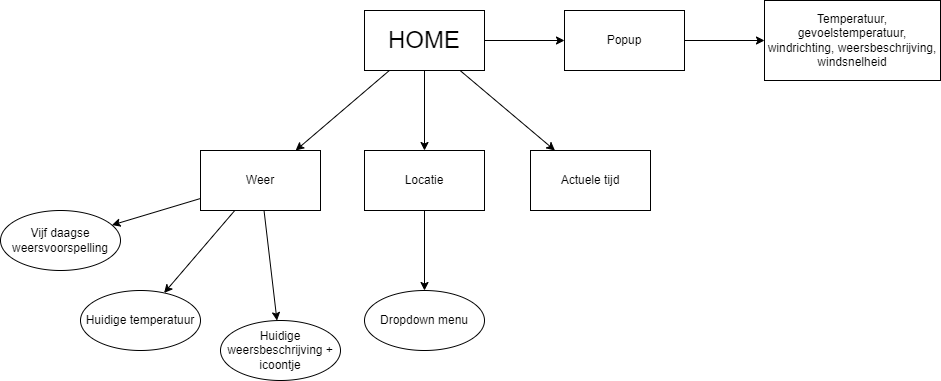
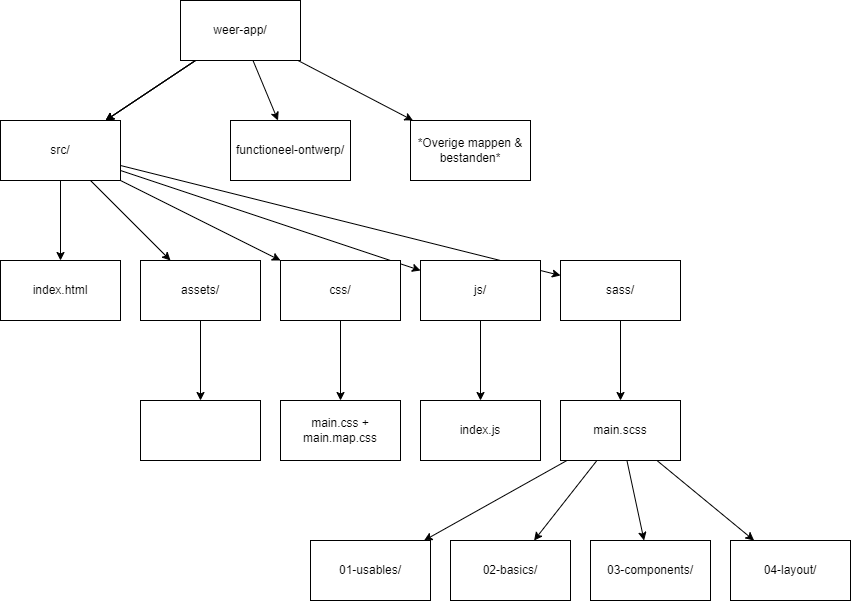
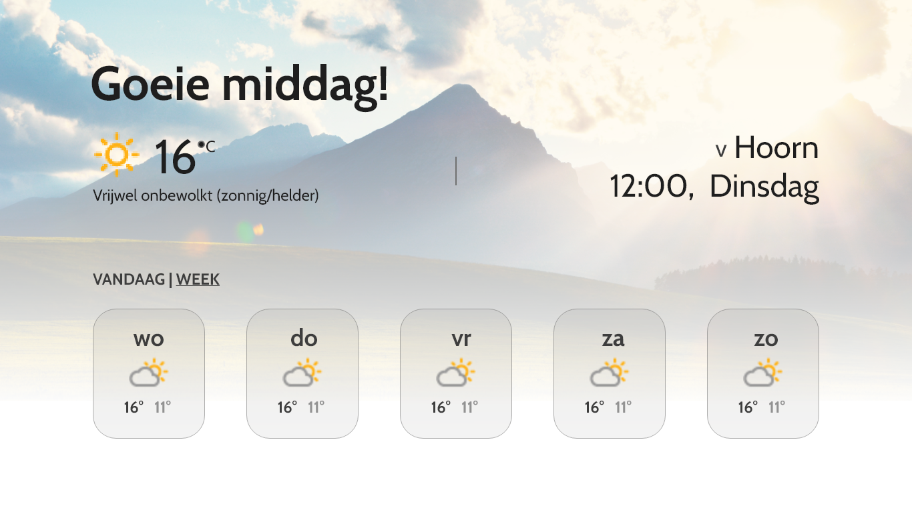

# weer-app-v4
 

 
### Door Santos van der Wansem en Fenne Hoogenboom (V4B)
### <a href="https://santosvdw.github.io/weer-app-v4/src/">Bekijk het project</a>

## Doelen en doelgroep:
Het doel van de website is om gebruikers informatie te bieden over de actuele weersomstandigheden in een gebied dat door de gebruiker zelf is uitgekozen. De doelgroep van deze website is mensen die benieuwd zijn naar het weer.

## Lijst van eisen en wensen
- De site moet weergegevens per locatie laten zien
- Achtergrond veranderen met verschillende weersomstandigheden
- Gebruikers moeten weers-locatie kunnen uitkiezen
- In één oogopslag het weer zien
- In één oogopslag de vijf daagse weersvoorspelling zien
- De site moet er goed uitzien op telefoons, tablets, laptops
- De site moet duidelijk weergeven wat de actuele temperatuur is.

## User stories
Wij hebben gegevens verzameld door onze vrienden en familie een kleine enquête te sturen. Veel van hun antwoorden kwamen overeen, we hebben de antwoorden van vier mensen samengevat in user stories. 

- Als iemand die regelmatig het weerbericht bekijkt wil ik graag een overzichtelijke weer-app zodat ik niet steeds hoef te zoeken naar de relevante informatie (weerverwachtingen) 
[V, 26]

- Als iemand die elke ochtend fietst wil ik graag een website waar ik makkelijk naar de temperatuur en neerslag verwachting kan kijken zodat ik mijn vertrektijd en kleding naar aanleiding daarvan kan kiezen. [M, 18]

- Als iemand die regelmatig het weer checkt vind ik het fijn als een weersite overzichtelijk is en als de relevante info [temperatuur en locatie] direct te zien is, zodat ik niet lang hoef te zoeken. [M, 55]

- Als iemand die alleen naar het weer kijkt om de weekvoorspelling te zien vind ik het fijn als ik direct naar de temperatuur en neerslag per dag kan kijken, zodat ik mijn weekactiviteiten efficiënt kan inplannen. [V, 16]

## Structuur
### Front-end:

### Back-end:

## Basiselementen
- <b>Lettertype</b>: Als lettertype hebben wij ‘Cabin’ gekozen, een sans-serif lettertype dat wij willen importeren vanuit google fonts. Wij hebben voor een sans-serif lettertype gekozen omdat we willen dat de site een moderne uitstraling heeft en omdat sans-serif lettertypes makkelijk leesbaar zijn (in tegenstelling tot bijvoorbeeld monospace lettertypes). 

- <b>Kleurschema</b>: Wij hebben er voor gekozen om alleen met zwart (#000000), wit (#FFFFFF) en grijs (#D2D2D2) te werken, omdat we van plan zijn om kleurrijke achtergronden en weer icoontjes te gebruiken. We willen namelijk niet dat de kleuren van bepaalde elementen niet goed samengaan met de kleur van bijvoorbeeld de achtergrond en zwart, wit en grijs zijn overal mee te combineren.

- <b>Icoontjes</b>: De icoontjes die wij willen weergeven op de site gaan wij importeren uit de buienradar API. We gaan niks aanpassen aan de styling van de icoontjes (behalve misschien de grootte)

## Schermontwerp

